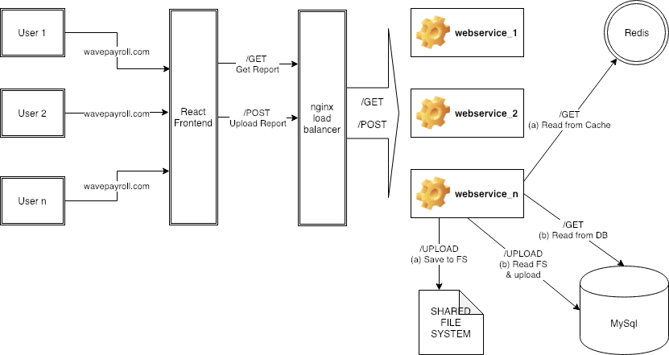

# Payroll Web Application

## Pre-req

1. Download and install docker and docker-compose.
2. Download and install Go. For this, you need to set up $GOPATH, $GOROOT and \$GOBIN.
3. Download and install npm.
4. Port 80 should be available for the application to serve.

## Steps to run the application

1. Place the provides tarball under path: go/src/github.com/ravjotsingh9/payroll-application
2. Make sure you have docker, docker-compose installed and have access to internet.
3. CD to payroll-application dir and run `docker-compose up --build`. This should start 4 docker processes.
4. On another terminal, CD payroll-application/frontend and run `npm install`
5. After npm install is done, start the frontend by running `npm start`. This should start frontend on http://localhost:3000

## Highlights

1. Scalable infrastructure. Using following command this system can be scaled
   `docker-compose up --build --scale webservice=2`
2. Optimized /GET Report to render almost by 46% (15 ms to 8 ms pr request) faster by using cache infront of database.

## System Design

## Furture work

1. Store processed report ids in global cache to response quickly for redundant report. [TASK]
2. Display specific message when upload fails. [BUG]
3. Ordering the generated report. [BUG]
4. Add Unit tests. [TASK]
5. Helm Chart: Use values.yaml for values [TASK]
